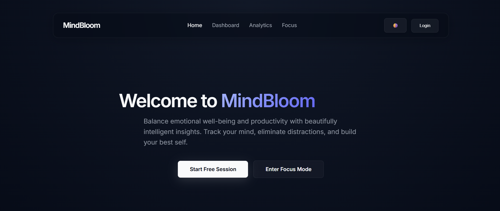
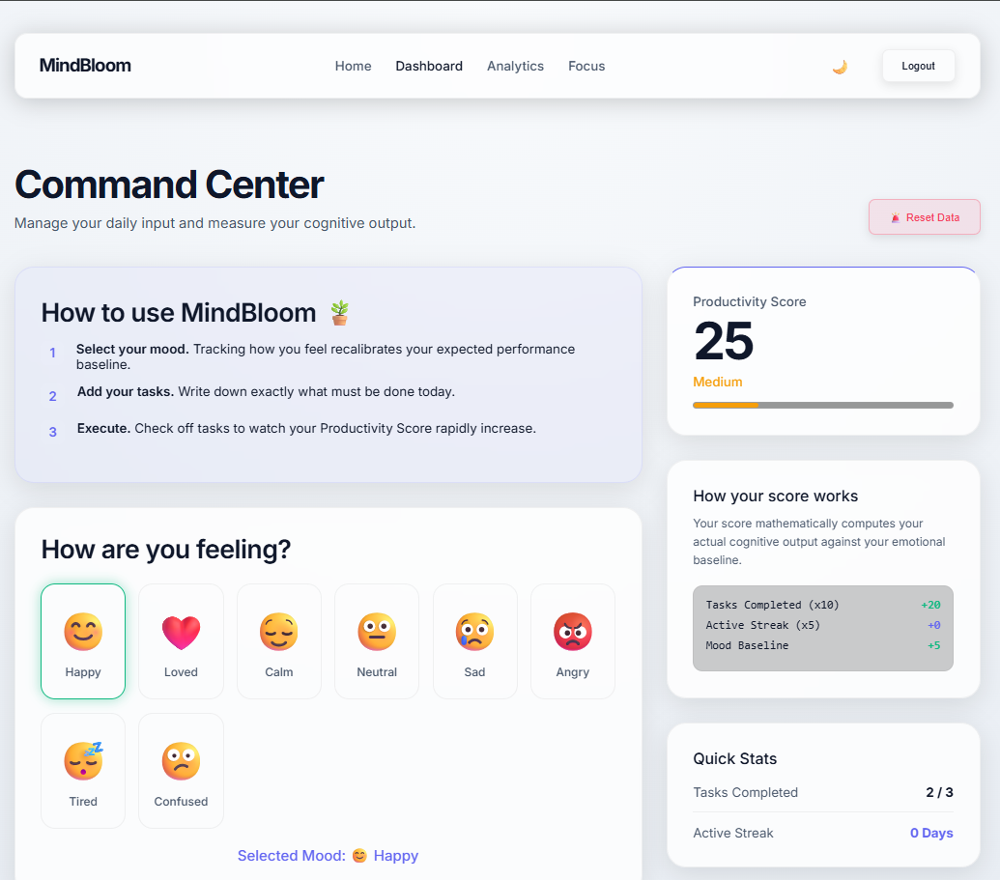
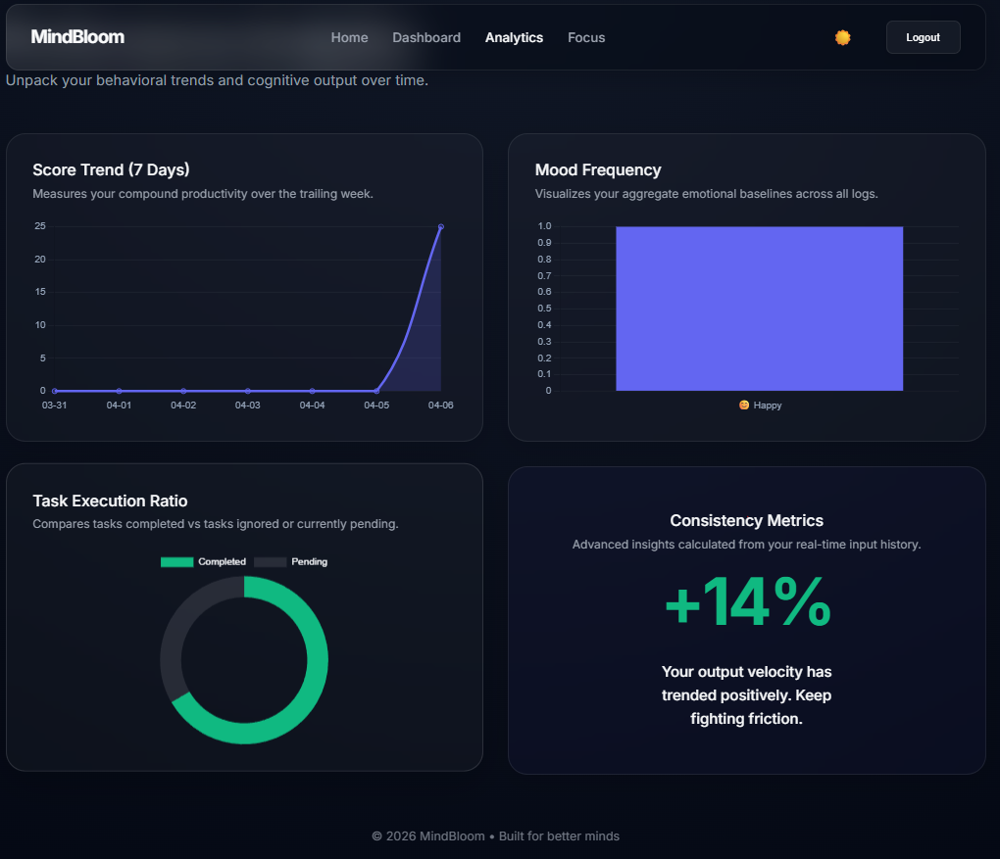

# 🌱 MindBloom – Productivity & Mood Analytics Dashboard

🔗 Live Demo: https://shivanshagarwal-27.github.io/Mind-Bloom/   
💻 GitHub Repo: https://github.com/shivanshagarwal-27/Mind-Bloom

---

## Overview

MindBloom is a productivity dashboard that connects **mood, tasks, and consistency** into a single system.

Instead of just tracking tasks, it focuses on how **emotional state + execution** together impact productivity.

---

## Screenshots

### 🏠 Home Page

### 📊 Dashboard (Light Mode)

### 📈 Analytics

---

## ✨ Key Features

* 😊 Emoji-based mood tracking
* ✅ Task management (add / complete)
* 🔥 Streak tracking
* 📊 Dynamic productivity score
* 📈 Visual analytics (Chart.js)
* ⏱️ Focus timer (Deep Work Mode)
* 🌗 Light / Dark mode support

---

## Core Logic

Productivity is calculated as:

Score = (Completed Tasks × 10) + (Streak × 5) + Mood Impact

* Positive mood → +5
* Neutral mood → 0
* Negative mood → -3

---

## 💡 Approach

* Built features as an interconnected system, not isolated components
* Focused on real-time feedback through UI and analytics
* Used localStorage for state management

---

## Tech Stack

* HTML
* CSS
* JavaScript
* Chart.js
* localStorage

---

## Outcome

This project demonstrates:

* Building a complete frontend application
* Managing state without backend
* Designing interactive UI with analytics

---

## Author

**Shivansh**
B.Tech CSE (Data Science)
